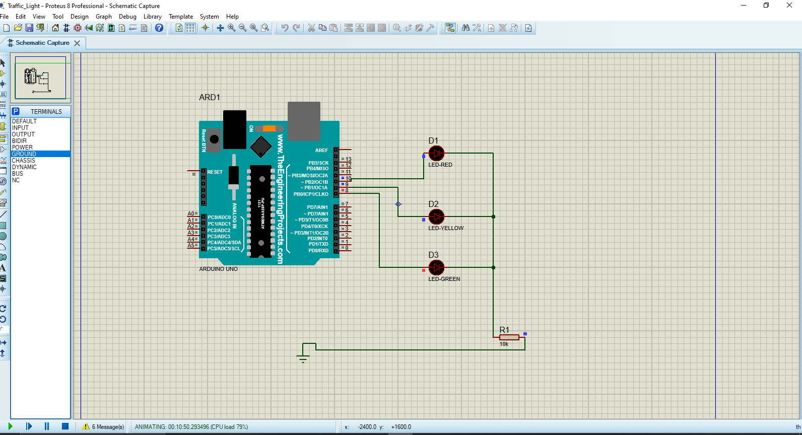
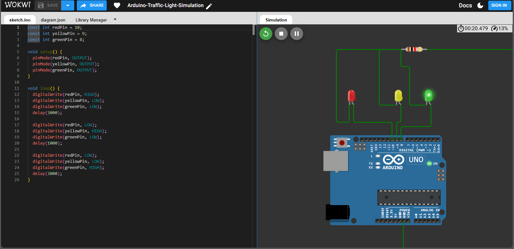

# 🚦 Smart Traffic Light Simulation Using Arduino Uno

A complete micro-controller traffic light project featuring both hardware circuit design and interactive browser-based simulation.

---

## 📌 Project Overview
This project implements a classic 3-phase traffic light controller (Red, Yellow, Green) using an **Arduino Uno**. It cycles through states with precise delays to simulate a real-world intersection traffic signal.

---

## 🛠️ Tools & Technologies
- **Arduino Uno & C++:** Core logic and microcontroller programming.
- **Proteus Professional:** Schematic capture and hardware simulation.
- **Wokwi Simulator:** Instant browser-based interactive testing.

---

## 🚀 Live Demo (Wokwi)
You can test and run the live circuit instantly in your browser:
👉 **[Click Here to Open Live Wokwi Simulation](https://wokwi.com/projects/471183359139706881)**

---

## 📸 Circuit & Simulation Visualizations

### 1. Proteus Hardware Design

### 2. Wokwi Live Simulation

---

## 📂 Repository Files
- `sketch.ino`: The source code written in Arduino C++.
- `diagram.json`: Circuit wiring layout configuration for Wokwi.
- `proteus-circuit.png`: Screenshot of the Proteus schematic layout.
- `wokwi-simulation.png`: Screenshot of the live web simulation.

